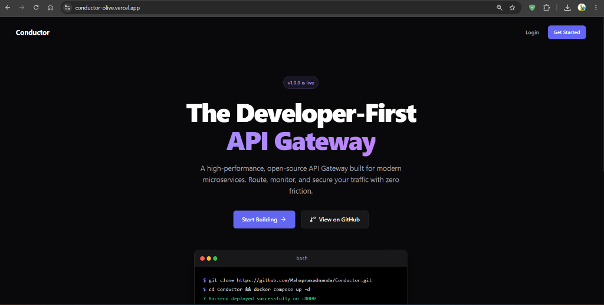
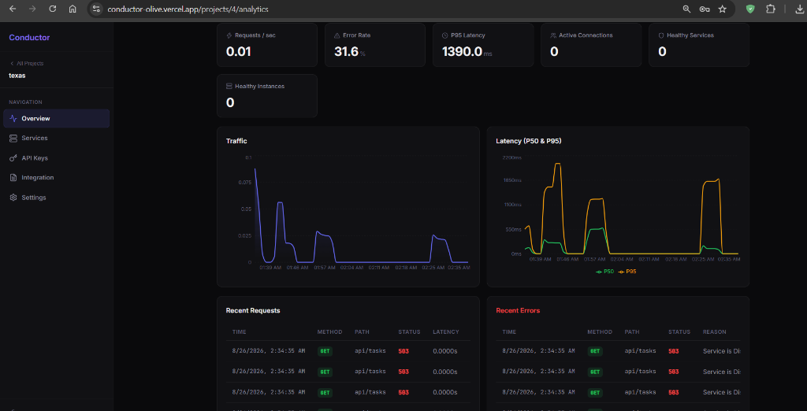
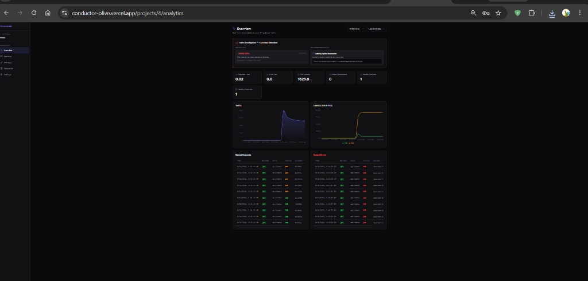
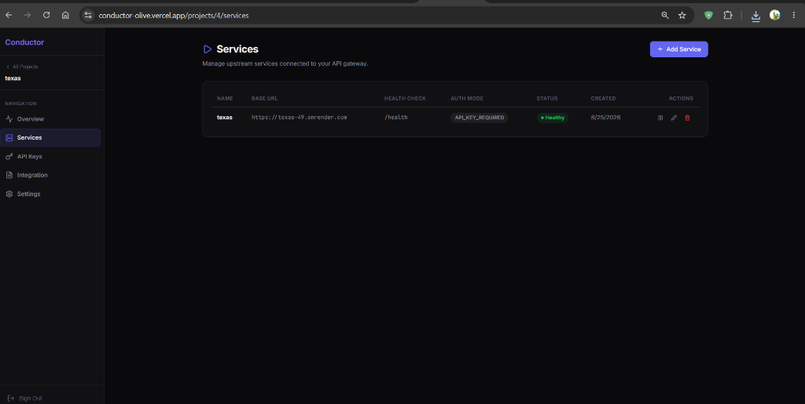
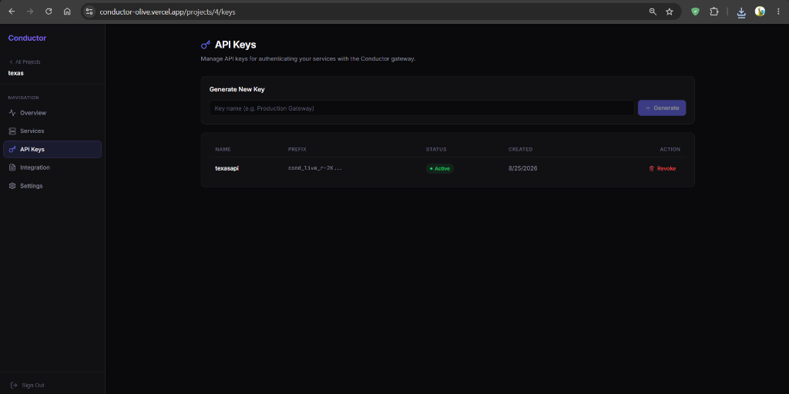

<div align="center">
  <h1>🚀 Conductor</h1>
  <p><strong>Developer-First API Gateway & Traffic Management Platform</strong></p>
  <p>Route, secure, control, and observe your APIs from one place.</p>
  <p>
    <a href="https://conductor-olive.vercel.app/login">Live Developer Portal</a>
    ·
    <a href="https://github.com/Mahaprasadnanda/Conductor">GitHub Repository</a>
  </p>
</div>

---

## 🌟 What is Conductor?

**Conductor** is an open-source API Gateway and management platform for modern microservices.

Instead of exposing every upstream service directly to clients, you register your services with Conductor and route traffic through a single gateway. Conductor provides routing, health checks, rate limiting, API-key authentication, load balancing, and traffic observability while giving developers a web portal to manage their APIs.

### The basic idea

```text
Client / Application
        │
        ▼
   Conductor Gateway
        │
        ├── Authentication
        ├── Rate Limiting
        ├── Health Checks
        ├── Load Balancing
        ├── Routing
        └── Metrics / Analytics
        │
        ▼
   Your Upstream APIs
```

---

<div align="center">
  
  <br>
  <em>The Developer-First API Gateway</em>
</div>

<br>

<div align="center">
  
  
  <br>
  
  
</div>

<br>

## ✨ Features

- **⚡ Async Gateway Routing** — FastAPI + async I/O for efficient proxying.
- **🔐 API Key & JWT Authentication** — Protect management and gateway traffic.
- **🚦 Redis-Backed Rate Limiting** — Control traffic without adding rate-limit state to application servers.
- **❤️ Active Health Checks** — Detect unhealthy service instances and keep them out of routing decisions.
- **⚖️ Load Balancing** — Route requests across healthy instances.
- **📊 Prometheus Metrics** — Expose gateway and application metrics for observability.
- **☁️ Grafana Cloud Integration** — Grafana Alloy forwards metrics to Grafana Cloud for dashboards and analysis.
- **🏢 Multi-Tenant Projects** — Organize services by project with tenant-aware isolation.
- **🖥️ Developer Portal** — Manage projects, services, API keys, integrations, settings, and analytics from a React/Vite dashboard.
- **🛡️ Production Resilience** — Redis rate limiting is fail-open, exceptions are logged internally, and the gateway is designed to remain available when observability dependencies fail.

---

## 🏗️ Architecture

```text
                    ┌──────────────────────┐
                    │   React / Vite UI    │
                    │      Vercel          │
                    └──────────┬───────────┘
                               │ HTTPS
                               ▼
                    ┌──────────────────────┐
                    │   FastAPI Backend    │
                    │       Render         │
                    └──────┬──────┬────────┘
                           │      │
                ┌──────────┘      └───────────┐
                ▼                             ▼
       ┌─────────────────┐            ┌─────────────────┐
       │    PostgreSQL   │            │      Redis      │
       │ Metadata/config │            │ cache / limits  │
       └─────────────────┘            └─────────────────┘

                    Metrics path

 FastAPI /metrics → Grafana Alloy → Grafana Cloud Prometheus → Grafana
```

### Repository structure

```text
Conductor/
├── backend/        # FastAPI API, gateway, auth, services, metrics
├── frontend/       # React + Vite developer portal
├── prometheus/     # Local Prometheus configuration
├── docker-compose.yml
└── README.md
```

---

## 🧑‍💻 Developer Workflow

The intended Conductor workflow is:

1. **Create an account** in the Developer Portal.
2. **Create a project** for your application or environment.
3. **Register a service** with its upstream base URL and health-check configuration.
4. **Register service instances** when your service has multiple upstream replicas.
5. **Generate an API key** for gateway access.
6. **Send traffic through the Conductor gateway** instead of calling the upstream directly.
7. **Monitor traffic and health** from the Conductor dashboard and Grafana.

### Example

Suppose you have an upstream API:

```text
https://api.example.com
```

and register it in Conductor as:

```text
Service name: users
Base URL:     https://api.example.com
Health path:  /health
```

A gateway request follows the pattern:

```text
/api/v1/gateway/<service-name>/<upstream-path>
```

For example:

```text
GET /api/v1/gateway/users/users/123
```

The gateway authenticates the request, applies traffic controls, selects a healthy instance, forwards the request, records metrics, and returns the upstream response.

> The exact gateway host depends on your deployment configuration. Use the gateway URL shown by your Conductor environment rather than hard-coding a localhost URL in application code.

---

## 🌐 Live Deployment

### Developer Portal

[Open Conductor](https://conductor-olive.vercel.app/)

### Backend

The production backend is deployed separately from the frontend. The frontend uses its configured API base URL to communicate with the backend.

### Observability

Production metrics are exported through **Grafana Alloy** to **Grafana Cloud Prometheus**. The Grafana dashboard can be used to inspect backend health, request rate, errors, latency, gateway state, and service metrics.

---

## 🚀 Local Development

### Prerequisites

- Docker Desktop with Docker Compose
- Node.js (only needed for frontend development outside Docker)
- Python 3.13 (optional for backend development outside Docker)

### 1. Clone the repository

```bash
git clone https://github.com/Mahaprasadnanda/Conductor.git
cd Conductor
```

### 2. Configure local environment

Create a local `.env` file from your environment template and provide your local PostgreSQL, Redis, JWT, and frontend configuration.

**Never commit `.env` or production credentials.**

### 3. Start the stack

```bash
docker compose up -d --build
```

This starts the local application stack, including:

- Frontend
- Backend
- PostgreSQL
- Redis
- Prometheus

### 4. Local URLs

| Component | URL |
|---|---|
| Developer Portal | http://localhost:3000 |
| Backend API | http://localhost:8000 |
| Swagger UI | http://localhost:8000/docs |
| Metrics | http://localhost:8000/metrics |
| Prometheus | http://localhost:9090 |

### 5. Check container status

```bash
docker compose ps
```

### 6. View backend logs

```bash
docker compose logs -f backend
```

### 7. Run backend tests

```bash
docker compose exec backend python -m pytest -v
```

---

## 🔑 API Keys & Gateway Requests

Conductor supports project/service management and gateway API keys.

A typical gateway request includes an API key header:

```bash
curl -i \
  "https://<gateway-host>/api/v1/gateway/<service-name>/<path>" \
  -H "Authorization: Bearer <CONDUCTOR_API_KEY>"
```

Replace the placeholders with values from your deployed Conductor project.

### Service lifecycle

Services can be enabled or disabled from the management interface/API. A disabled service should not receive gateway traffic.

---

## 📊 Observability

Conductor exposes Prometheus-compatible metrics, including gateway and HTTP metrics.

Examples include:

```text
gateway_requests_total
gateway_inflight_requests
gateway_instances_registered
gateway_services_registered
gateway_request_latency_seconds
http_requests_total
http_request_duration_seconds
```

The production metrics flow is:

```text
FastAPI /metrics
      ↓
Grafana Alloy
      ↓
Grafana Cloud Prometheus
      ↓
Grafana Dashboard
```

The dashboard can be used for signals such as:

- backend health
- HTTP request rate
- request throughput
- HTTP error rate
- 4xx vs 5xx traffic
- P50 / P95 / P99 latency
- gateway in-flight requests
- registered services
- healthy gateway instances

---

## ☁️ Production Deployment

The deployed architecture uses:

- **Frontend:** Vercel
- **Backend:** Render
- **Metrics:** Grafana Cloud + Grafana Alloy
- **Database:** PostgreSQL-compatible production database
- **Cache / rate limiting:** Redis-compatible production service

### Frontend deployment

1. Connect the repository to Vercel.
2. Set the frontend directory as the project root.
3. Use the Vite framework preset/build configuration used by the repository.
4. Configure the frontend API base URL environment variable to point to the deployed backend.
5. Deploy.

### Backend deployment

1. Connect the repository to Render.
2. Deploy the `backend` Dockerfile.
3. Configure production database, Redis, JWT, CORS, and Grafana environment variables in Render.
4. Keep secrets in the platform's environment settings; never commit them to Git.
5. Deploy and verify `/docs`, `/metrics`, authentication, gateway routing, and database connectivity.

> Exact provider settings can change over time. Use the provider dashboards and the repository's current Docker configuration when deploying.

---

## 🔒 Security Notes

- Do not commit `.env`, production tokens, JWT secrets, database passwords, or API keys.
- Use a newly generated `JWT_SECRET_KEY` for production.
- Rotate any credential that is accidentally exposed.
- Restrict CORS to the intended frontend origin(s) in production.
- Use HTTPS for production frontend, backend, and upstream integrations where supported.
- Treat Conductor API keys as secrets.

---

## 🤝 Contributing

Contributions are welcome.

```bash
# Create a feature branch
git checkout -b feature/my-feature

# Make your changes, then commit
git add .
git commit -m "Add my feature"

# Push the branch
git push origin feature/my-feature
```

Then open a Pull Request against `main`.

Before opening a PR, run the relevant tests and make sure secrets or local database/log files are not included.

---

## 🐛 Issues & Support

Please use GitHub Issues for bugs, feature requests, and implementation discussions:

[Conductor Issues](https://github.com/Mahaprasadnanda/Conductor/issues)

For direct contact:

- **Email:** Mahaprasad.programmer@gmail.com
- **GitHub:** [Mahaprasadnanda](https://github.com/Mahaprasadnanda)

---

## 📄 License

See the repository for the current license information.

---

<div align="center">
  <p>Built with ❤️ for developers.</p>
</div>
